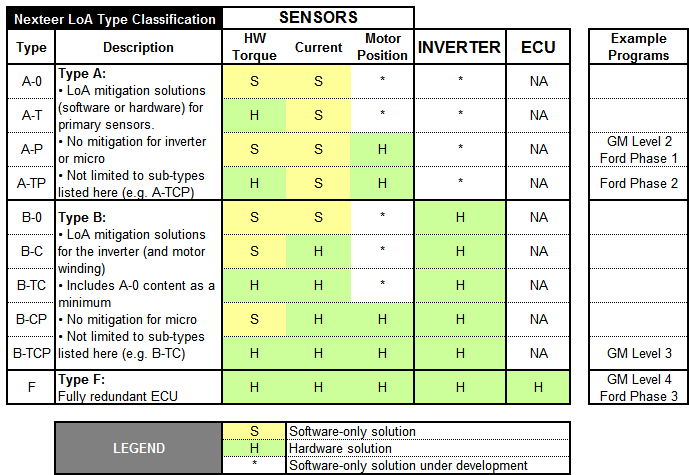

The classification behind every safety one-pager: what stays alive under which fault,
and whether the fix is software-only or hardware.

## Files

- `LoA Naming Convention.png` — naming diagram (copied to this site's assets where used).
- `Nexteer LoA Types v1.xlsx` — matrix: SENSORS / Current / ECU / INVERTER ×
  HW Torque / Motor Position, types A-P / A-TP / A-T / A-0 / B-0 / B-T / B-P / B-TP / F (fully redundant ECU),
  single vs. dual inverter, software-only vs. hardware legend. Ford Phase 2 column included.
- `Nexteer LoA Types v2 draft.xlsx` — draft revision of the same matrix.
- `Nexteer LoSAS Types v1.xlsx` — subsystem-level companion.

:::tip[Use with]
[TRM-130](../../trm/trm-130/) (FET faults), [TRM-155](../../trm/trm-155/) (inverter LoA HW),
[TRM-002](../../trm/trm-002/) (cross-check), redundant-controller + sensorless pages.
:::

## Sources

| Original file | Size | Type |
|---|---|---|
| `supporting material/LoA Naming Convention.png` | 45 KB | PNG |
| `supporting material/Nexteer LoA Types v1.xlsx` | 15 KB | XLSX |
| `supporting material/Nexteer LoA Types v2 draft.xlsx` | 16 KB | XLSX |
| `supporting material/Nexteer LoSAS Types v1.xlsx` | 16 KB | XLSX |
